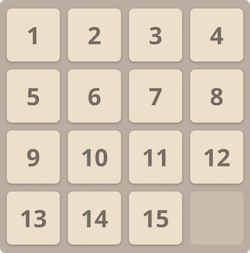
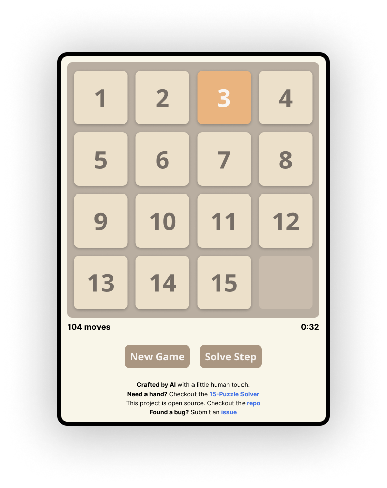
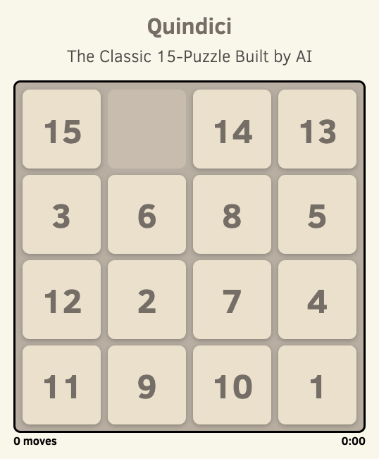
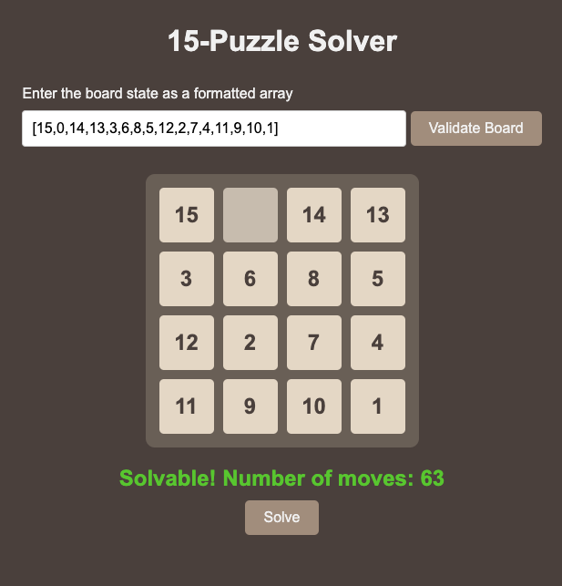
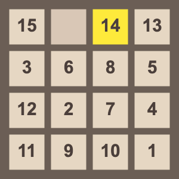

# Quindici
The Classic 15-Puzzle crafted by AI with a little human touch

# **Introduction**

The **15-puzzle**, also known as the **Game of Fifteen**, is a classic sliding puzzle that has intrigued enthusiasts since the late 19th century. Consisting of a 4x4 grid with 15 numbered square tiles and one empty space, the objective is to rearrange the tiles into sequential order, typically from 1 to 15, using the empty space to slide tiles into position. 



Invented by Noyes Palmer Chapman in 1874, the puzzle gained immense popularity and sparked a global craze due to its deceptively simple design and challenging nature. It has since become a staple in the world of puzzles and continues to be a benchmark for problem-solving and algorithmic research.

This project brings the timeless 15-puzzle to the digital realm, enhanced with modern features such as keyboard controls, a solve step hint system, and an optimal solver using the A* search algorithm.



## **Slide Multiple Tiles**

Multiple tiles can be slid/shifted at once as long as the empty slot is within the same row or column. This functionality mirrors the physical movement in the traditional puzzle, allowing for more efficient and intuitive gameplay.

- **Keyboard Shortcut**: Use **Shift + Arrow Key** to move multiple tiles with the keyboard.
- **Mouse Control**: Click on a tile in the same row or column as the empty space to slide it (and any adjacent tiles) into the empty slot.


## **Solve Step Button**

Stuck on a challenging configuration? The **Solve Step** button offers assistance by suggesting the next move towards solving the puzzle. It utilizes a **greedy best-first search algorithm** to provide a helpful hint without revealing the entire solution path.

- **Usage**: Click the **Solve Step** button once or multiple times to receive incremental hints.
- **Note**: This feature does not guarantee the optimal path but guides you closer to the solution. For the optimal path, use the **15-Puzzle Solver** described below.

## **Keyboard Shortcuts**

To enhance the gameplay experience, the puzzle supports a variety of keyboard shortcuts for quick and efficient interaction:

- **Arrow Keys (↑ ↓ ← →)**: Shift tiles into the empty space in the corresponding direction.
- **Shift + Arrow Key**: Move multiple tiles into the empty space when aligned in the same row or column.
- **a**: Start a new game.
- **s**: Perform a solve step to get a hint.
- **x**: Pause or unpause the game.
- **f**: Open the solver to find the optimal solution.
- **?**: Open the keyboard shortcut help menu.

These shortcuts allow for seamless control and can significantly improve solving speed.

## **Setting Board State**

A board state can be passed as a URL parameter, enabling users to share specific puzzle configurations with others or save them for future play.

The initial board state can be represented by an array. For example: `[15,0,14,13,3,6,8,5,12,2,7,4,11,9,10,1]`

Which in turn can be represented as a hexidecimal string: `f0ed3685c274b9a1`

When passed as a URL parameter (`https://quindici.io/?board=f0ed3685c274b9a1`), it will render the board state:




### How to Share:
  1. Arrange the puzzle to the desired state.
  2. The 15-Puzzle Solver link always contains the URL parameter representing the current state of the board which can be copied and appended to the base URL. Or, if you've solved the puzzle, use the **Share Game** button.
  3. Share the URL with others, who can load the same board state by accessing the link.

This feature is perfect for:

- **Challenging Friends**: Send a difficult puzzle to friends and see who can solve it faster.
- **Resuming Later**: Save the link to continue solving at a later time.
- **Analyzing Puzzles**: Pass the board state to the solver to study the optimal solution path.

## **15-Puzzle Solver**

The **15-Puzzle Solver** is a powerful tool designed to find the optimal solution for any valid puzzle configuration using the **A\*** (A-star) search algorithm.




- **Features**:
  - **Optimal Solution Path**: Calculates the minimum number of moves required to solve the puzzle.
  - **Visualization**: Provides a step-by-step animation of the tiles moving into place.
  - **Animated GIF**: Allows users to download an animated GIF of the solution process.
  - **Move Count**: Displays the total number of moves in the optimal solution.

- **Usage**:
  1. Access the solver via the **Solver** link or by pressing the **f** key.
  2. If you have a specific board state, include it in the URL or input it manually.
  3. The solver will process the puzzle and present the optimal solution.

Here's an example of an animated GIF of the solution path for the board state above:




**Note**: The solver is an excellent resource for learning and understanding the strategies behind solving the 15-puzzle efficiently.


# **Additional Information**

## **Features**

- **Responsive Design**: The game adapts to different screen sizes, ensuring a seamless experience on desktops, tablets, and mobile devices.
- **Accessible Controls**: Both keyboard and mouse/touch inputs are supported, catering to various user preferences.
- **Pause Functionality**: Pause the game at any time using the **x** key.
- **Move Counter and Timer**: Keep track of your progress with a real-time move counter and timer.

## **Technology Stack**

- **Frontend**: HTML5, CSS3, and vanilla JavaScript.
- **Algorithms**: Implementations of the A* search algorithm for the solver and greedy best-first search for solve steps.


# **Installation**

No installation is required to play the game. Simply access it via the web:

```plaintext
https://quindici.io/
```

To run the project locally:

1. **Clone the Repository**:

   ```bash
   git clone https://github.com/justinpobrien/quindici.git
   ```

2. **Navigate to the Project Directory**:

   ```bash
   cd quindici
   ```

3. **Open `index.html` in Your Browser**

4. **Optional - Run a Local Server**


# **Usage**

- **Starting a New Game**: Click the **New Game** button or press the **a** key.
- **Moving Tiles**: Use the arrow keys or click/tap on the tiles adjacent to the empty space.
- **Pause the Game**: Press the **x** key to pause or unpause.
- **Access Keyboard Shortcuts**: Press the **?** key to view all available shortcuts.
- **Solving the Puzzle**:
  - **Step-by-Step Hints**: Use the **Solve Step** button or press **s**.
  - **Optimal Solution**: Press **f** to open the solver for the current board state.

# **License**

This project is open-source and available under the [MIT License](LICENSE). You are free to use, modify, and distribute this software as per the license terms.
